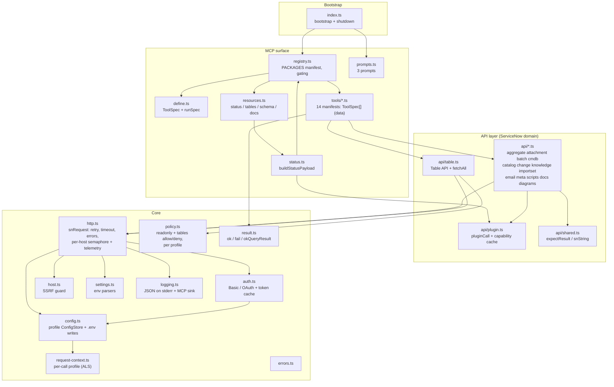
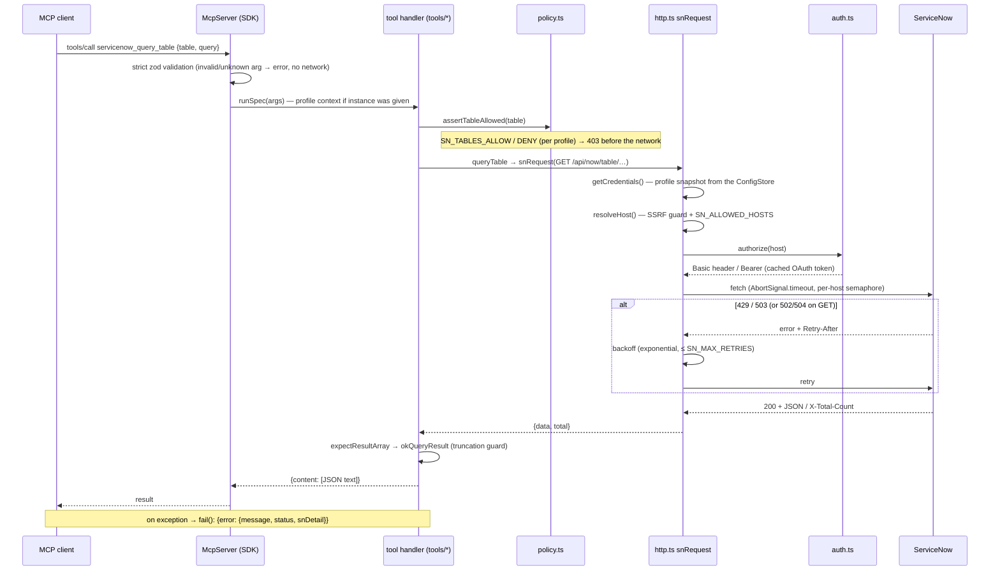
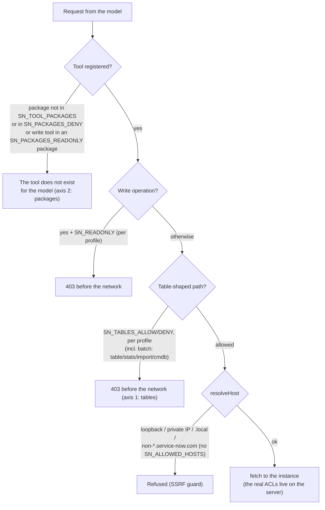
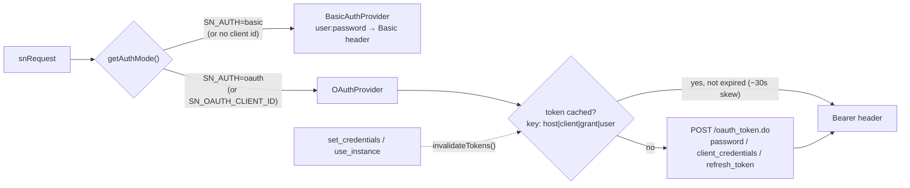
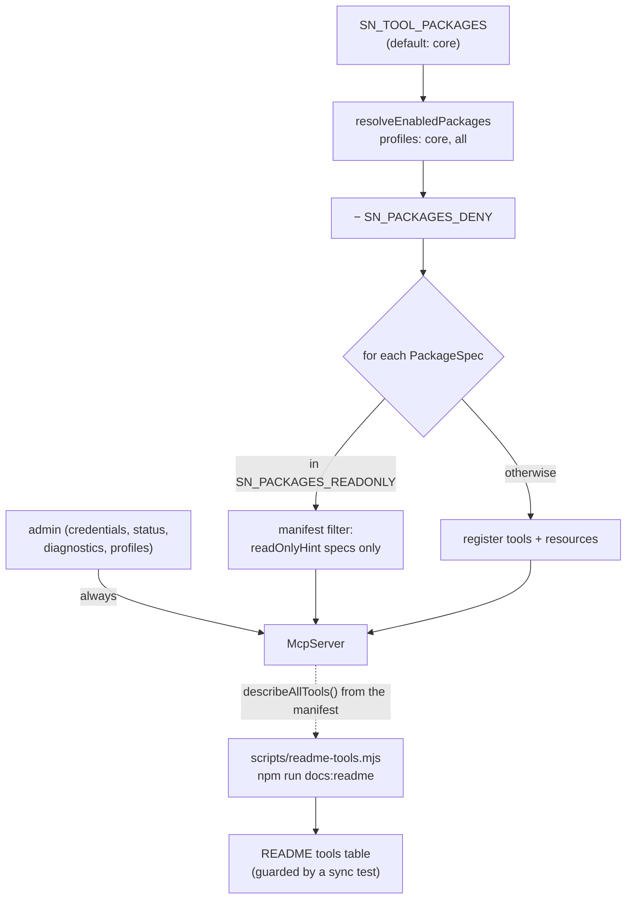

# servicenow-mcp — Architecture

Date: 2026-07-06 · Reflects the committed code through v2.0 (Phases 1–9 + DX; 406/406 tests). The **dark Jira Cloud client scaffold** (committed 2026-07-03 in `ad2799c`; no tools registered) is deliberately not covered here until the ARCH-14 decision lands (see TODO.md).
Related documents: [PRODUCT-STATE.md](PRODUCT-STATE.md) (state), [IMPLEMENTATION-PLAN.md](IMPLEMENTATION-PLAN.md) (future), [DONE.md](DONE.md) (history), [WORKLOG.md](../WORKLOG.md) (chronology).

## 1. What servicenow-mcp is

A TypeScript **stdio MCP server** for ServiceNow: an LLM client (Claude, VS Code Chat, Inspector…) gets 97 tools in 26 packages over the ServiceNow REST surface — Table, Aggregate, Attachment, Import Set, Batch, Service Catalog, Change Management, Knowledge, Email, CMDB/IRE, script intelligence, flow tracing, local code checking, ATF runs, Mermaid generators and local self-documentation, a journal-based revert of local writes, generic reads of any registered artifact type (with its child records) and a plan-first upsert of scalar and parent/child artifact types (`servicenow_upsert_artifact`), Fluent (`.now.ts`) source generation for scalar artifact types (`servicenow_generate_fluent`), record history (audit + journal), system properties and user / group / role lookups. One process, no runtime dependencies beyond `@modelcontextprotocol/sdk`, `zod` and `dotenv`; all I/O is JSON over stdio (logs go to stderr only).

The principles that hold the design together:

1. **One HTTP client** — everything goes through `snRequest()` (auth, SSRF guard, timeout, retry, error mapping happen once).
2. **Policy in the client (defense in depth)** — restrictions (read-only, tables, packages, per-profile) are enforced _before_ the network; we do not rely on the instance's ACLs alone.
3. **The code is the source of truth** — the README tools table is generated from the registrations; a sync test fails when it drifts.
4. **Tests without a network** — the whole suite (406, incl. property-based and perf guards) runs over a mock `fetch` + an in-memory MCP transport.

## 2. Layers and modules

Notes:

- `tools/*` are **data**: each file exports `specs: ToolSpec[]` (name/docs/package/annotations/strict zod input/handler); `mcp/define.ts#runSpec` provides uniform logging/error handling and the per-call profile routing. **A package is one `PackageSpec` object** `{name, tools, resources?}` in the `PACKAGES` manifest — plugged in/out with one line, resources follow the same policy declaratively, a runtime invariant keeps the tags consistent. Domain logic lives in `api/*`.
- Layers are machine-enforced (ESLint no-restricted-imports zones, M-2); a light residual cycle `registry → tools/admin → status → registry` is fine in ESM (usages are call-time only).
- Every tool also carries an automatic optional `instance` argument (MI-3): the call runs in that profile's AsyncLocalStorage context, and everything below resolves the profile at call time — no api/ signature threads it.
- Every tool call also runs in a **call context** (M-3, `runWithCall` in `src/core/request-context.ts`): `runSpec` receives the SDK `extra` and records `{requestId, sessionId?, tool, profile, signal, progress}`. The logger merges `{profile, requestId, sessionId?, tool}` into every line; `snRequest` falls back to the call's `signal`, so a cancelled call aborts its in-flight fetch, queue wait or retry backoff and fails with `CANCELLED` without being retried; `src/core/progress.ts` (`trackProgress`, `reportProgress`, `fetchAllProgress`) reports steps that `src/mcp/progress.ts` turns into throttled, monotonic `notifications/progress` — a no-op without a `progressToken`. A tracker tick is also a cancellation checkpoint for loops that swallow per-step errors as warnings (snapshot, compare).

## 3. Lifecycle of a request

Key details:

- **Retry matrix:** 429/503 retry for all methods; 502/504 and transport errors retry only for GET (a write's outcome is unknown → never duplicate mutations). A single 401 with a cached OAuth token forces one re-authentication. `Retry-After` is honoured both as seconds and as an HTTP date.
- **Truncated results:** `okQueryResult` halves the record set iteratively until it fits `SN_MAX_RESULT_CHARS`, with a note explaining how to narrow the query.

## 4. Security model (two axes + network guards)

- **Axis 1 — tables** (`SN_TABLES_ALLOW`/`SN_TABLES_DENY`): guards the Table API, CMDB classes, Import Set and batch sub-requests (incl. `stats`/`import`/`cmdb/instance` URLs). Per-profile overrides via `SN_PROFILE_<NAME>_TABLES_*`.
- **Axis 2 — packages** (`SN_PACKAGES_DENY`/`SN_PACKAGES_READONLY`): the only way to restrict the plugin APIs (catalog/change/knowledge…), which have no table path. A read-only package means its write tools are never registered (manifest filter on `readOnlyHint`). Batch sub-requests are mapped back to their owning package and checked against the same deny/read-only axes, so a batch cannot reach a denied plugin API or write to a read-only one.
- **Global:** `SN_READONLY` blocks all mutations (per-profile override: `SN_PROFILE_<NAME>_READONLY`); the SSRF guard has no opt-out for internal addresses.
- **Hardened for public release:** the `.env` file is written owner-only (`0600`), and a host must be `*.service-now.com` unless `SN_ALLOWED_HOSTS` is set — so a redirected or mistyped host cannot silently receive Basic credentials — on top of the SSRF guard and the X-2 elicitation confirmation.

## 5. Authentication

The password is not part of the cache key → credential changes explicitly clear the cache (`invalidateTokens()`), so a token can never outlive the secrets it was minted with. A server-side revocation (401 before TTL) recovers with exactly one forced re-auth.

## 6. Configuration

- **Env-first:** values supplied by the MCP client always win (`dotenv` with `override:false`); the `.env` file is resolved as `SN_ENV_FILE` → XDG (`~/.config/servicenow-mcp-ai/.env`) → project root.
- **Profile ConfigStore (credentials):** the environment is only the _initial_ source — the first read of a profile takes an immutable snapshot; `saveCredentials` writes the file atomically (temp + rename), updates `process.env` (for child processes) and swaps the store in a single assignment. A torn read ("new user + old password") is structurally impossible. Named profiles: `SN_PROFILE_<NAME>_*` keys; the bare keys are the `default` profile; `SN_ACTIVE_PROFILE` (or a per-call `instance` argument) selects one.
- **All settings** (timeout, retries, limits, packages, log level) are read through `settings.ts` with validating parsers and documented defaults (README env table + `.env.example`).

## 7. Tool packages and registration

The `core` profile = table + schema + aggregate + attachment (+ the always-on admin tools = 19 tools); `all` = all 17 opt-in packages (61 tools; the always-on `admin` package is the 18th, bringing the full count to 67). `effectivePackages()` is the single source of truth — used by registration, the status payload and the generators.

## 8. Errors and results

- Every tool response is JSON text: `ok(data)` / `okStructured(data)` (adds structuredContent for tools with an outputSchema) / `okQueryResult(records, total)` (with truncation) / `fail(error)`.
- `fail` preserves the `ServiceNowError` structure: `{ error: { message, status, snDetail } }` — the model reacts differently to 401 (credentials), 403 (policy/ACL), 429 (rate limit).
- `pluginCall` translates ServiceNow's most misleading error: a 404 for a whole namespace (= inactive plugin) is distinguished from a 404 for a missing record; the namespace variant is cached for 5 minutes (fail-fast, no network) and surfaces as `pluginApis` in the status payload.

## 9. Test architecture

| Level                | Files                                                                                                                                                                                                                                                                                                                                                 | What it protects                                                                                                                         |
| -------------------- | ----------------------------------------------------------------------------------------------------------------------------------------------------------------------------------------------------------------------------------------------------------------------------------------------------------------------------------------------------- | ---------------------------------------------------------------------------------------------------------------------------------------- |
| Pure unit            | `config.test`, `settings.test`, `result.test`, `logging.test`, `servicenow.test` (host), `profiles.test`, `policy.test`, `write-journal.test`                                                                                                                                                                                                         | env parsers, .env round-trip, truncation + perf, SSRF, log filter, profiles, policy engine, write journal                                |
| api/ over mock fetch | `http.test`, `http-retry.test`, `http-util.test`, `fetchall.test`, `auth.test`, `batch.test`, `phase3.test`, `scripts.test`, `meta.test`, `attachment.test`, `diagrams.test`, `plugin.test`, `config-store.test`, `email.test`, `jira-http.test`, `jira-host.test`, `jira-adf.test`, `http-twin-parity.test`, `http-resilience.test`, `identity.test` | domain logic + retry/policy/caches/telemetry, zero network; the dark Jira client + the twin-parity drift guard                           |
| MCP surface          | `mcp-smoke.test` (SDK Client + `InMemoryTransport`)                                                                                                                                                                                                                                                                                                   | zod schemas, argument mapping, envelopes, package gating, **core contract snapshot**                                                     |
| Documentation guards | `readme-sync.test`, `manifest-snapshot.test`, `packages.test`, `env-docs-sync.test`, `version-sync.test`                                                                                                                                                                                                                                              | README ↔ code sync; manifest fixture; package resolution; every `SN_*` var documented; one version across every carrier + launcher guard |
| Property-based       | `property.test` (fast-check)                                                                                                                                                                                                                                                                                                                          | the env and base64 codecs over arbitrary inputs                                                                                          |

Shared helpers (`test/helpers.js`): `baselineEnv` / `withEnv` (env snapshot/restore + ConfigStore reload), `withFetch` (global fetch swap with recorded calls), `jsonResponse`.

## 10. Key design decisions (condensed ADRs)

| #   | Decision                                                    | Why                                                                             | Alternative (rejected)                                                                                                       |
| --- | ----------------------------------------------------------- | ------------------------------------------------------------------------------- | ---------------------------------------------------------------------------------------------------------------------------- |
| 1   | stdio transport, stdout reserved for the protocol           | the simplest integration with MCP clients                                       | HTTP-only transport (a token-guarded loopback Streamable HTTP shipped later as opt-in DF-6 in v2.0; stdio stays the default) |
| 2   | Policy in the client, before the network                    | defense in depth + clear errors without hammering the instance                  | relying on server-side ACLs alone                                                                                            |
| 3   | Package policy axis via (non-)registration of specs         | an invisible tool is the safest tool; zero checks in handlers                   | runtime checks in every handler                                                                                              |
| 4   | ConfigStore snapshot for credentials (now per profile)      | atomicity + the anchor for profiles                                             | a full store for all SN\_\* upfront (double refactoring)                                                                     |
| 5   | Namespace-404 cache in `pluginCall`                         | the same status code also means "no record" — only proven API absence is cached | caching every 404 (would lock out valid APIs)                                                                                |
| 6   | README table generated from the registrations               | the code is the truth; a sync test stops drift                                  | a manual table (it kept drifting)                                                                                            |
| 7   | `node:test` + mock fetch, no network                        | speed (~3.5 s), determinism, CI without secrets                                 | vitest (an option), e2e against a PDI (optional)                                                                             |
| 8   | PackageSpec manifest: package = tools + resources, 1 object | plug-in modularity; gating and docs read one truth                              | imperative register functions (deleted)                                                                                      |
| 9   | Per-host semaphore/telemetry, caches keyed by instance      | Phase 7 profiles arrive without refactoring; one instance cannot starve another | global counters (replaced)                                                                                                   |
| 10  | Per-call profile via AsyncLocalStorage                      | no api/ signature threads a profile; everything resolves it at call time        | threading a profile argument through 20+ functions                                                                           |

## 11. What is next architecturally

Phases 6–9 and the DX/GA sweeps are shipped (full record in [DONE.md](DONE.md)); no build-phase work is in progress. A **v3.0 plan was proposed on 2026-09-02** ([ROADMAP-V3.md](ROADMAP-V3.md), evidence in [DEEP-REVIEW-2026-09.md](DEEP-REVIEW-2026-09.md), the 2026-09-09 second pass [GAP-ANALYSIS-2026-09.md](GAP-ANALYSIS-2026-09.md) and the 2026-09-23 instance-documentation pass [INSTANCE-DOCS-ANALYSIS-2026-09.md](INSTANCE-DOCS-ANALYSIS-2026-09.md), which adds S-14 … S-16 — a docs store with provenance frontmatter and a manifest, a shared Mermaid module `src/api/mermaid.ts`, and `src/api/document.ts` with table / app / instance document generators behind three `servicenow_document_*` tools; its 2026-09-25 second pass [INSTANCE-DOCS-ANALYSIS-2026-09-25.md](INSTANCE-DOCS-ANALYSIS-2026-09-25.md) re-bases S-15 on the landed artefact registry, P-5's `listArtifacts` collector, S-3's `securityScan()` and named E-7 collectors in `src/api/collectors.ts`); the code described above gained `src/core/lifecycle.ts` (E-9), `src/core/runtime.ts` (E-3) and `src/core/dispatcher.ts` + `src/core/identity.ts` (H-10) from the 2026-09 hardening items, the trace / table-flow generators walk the table inheritance chain (S-1), the HTTP client rejects a 2xx HTML page with `INSTANCE_HTML_RESPONSE` and `fetchAll` reads past ACL-shortened pages under a scan budget (`cap × 10` rows; `truncatedReason` / `filtered`) (H-8), and the release tooling gained `scripts/pack-check.mjs` + `scripts/sync-version.mjs` with SHA-pinned, least-privilege workflows (H-9) — all uncommitted. The open architectural threads are:

- **v3.0 (proposed 2026-09-02; H-1, H-2, E-9, H-10, S-1, H-8, H-9 and E-3 landed locally in 2026-09, the other architectural items below are not started):** **E-3** (done) is the runtime container: `createRuntime()` in `src/core/runtime.ts` is built once in `src/index.ts`, installed as the process runtime and passed to `registerAllTools`, which runs every tool call inside `runWithRuntime()` (AsyncLocalStorage). Each stateful module declares its state as a lazily created _part_ (`defineRuntimePart`: schema cache, tokens, telemetry, queue, breakers, dispatchers, profile store, plugin availability) and resolves it through `currentRuntime()`, so public signatures are unchanged; `runtime.dispose()` clears every part in place, then runs the `onDispose` hooks (idempotent, concurrent calls share one run), and `lifecycle.dispose()` / `registerDisposer()` are thin delegates. The `_reset*` test hooks are gone — tests install a fresh runtime (`freshRuntime()` in `test/helpers.js`). The remaining items are **E-4** a validated, fail-fast settings object built once at start-up (A2-2; drops the implicit cwd `.env` autoload), **H-7** a per-session HTTP transport (session map, session-owned active profile, DNS-rebinding guard, health endpoint, graceful shutdown), **M-2** an error contract with a stable machine `code` (`snDetail` → `detail`; resources throw `McpError` — A2-5), **H-3** plan tokens binding a destructive `apply` to a preceding plan, and **S-2/S-6** a journal with before-state, revert and update-set awareness. ARCH-10 / ARCH-14 resolve together in **E-8**.
- **SDK parity epic (post-3.0):** an artefact registry (P-1) as the single source for artefact reads, explain, lint / search, snapshot and, later, Fluent generation — planned in [SDK-PARITY.md](SDK-PARITY.md) (P-1…P-29, owner gates O-5…O-9); nothing started.
- **ARCH-14 (owner decision):** the dark Jira Cloud surface — go/no-go and packaging. If "go", it becomes a separate subordinate surface reusing the same safety rails (package axis, plan/apply, write journal, redaction). Until then the scaffold stays dark, pinned by the http-twin parity test.
- **ARCH-10 Option E:** a shared hook-parameterised HTTP engine for the ServiceNow and Jira clients — only if ARCH-14 lands as "build"; do not unify speculatively. The parity test (`test/http-twin-parity.test.js`) is the shipped drift guard (Option L).
- **GA-9 (owner-gated):** a nightly e2e smoke suite against a live PDI — the only remaining test-architecture gap (the suite is 100% mock-fetch today).
- **Doc-drift automation:** generate the prose numbers (test count, coverage, tool count) the way the README tools table is generated, guarded by a sync test.

## HTTP transport sessions (H-7)

`SN_TRANSPORT=http` serves one `StreamableHTTPServerTransport` and one
`McpServer` per MCP session (`src/mcp/http-sessions.ts`). The server is built by
`buildMcpServer(runtime)` (`src/server.ts`) on a **session runtime** created with
`createRuntime({ parent })`: runtime parts declared `scope: "process"` (the
schema cache, OAuth tokens and bearer files, the request queue and breakers,
dispatchers, telemetry and metrics, the profile store, update-set locks, the
SDK project scan) resolve to the parent and are shared; every other part
(package session, plan tokens, tasks, write counters and caps, plugin
availability, capability matrix) is per session and disposed with it. Each
request runs inside `runInSession` (`src/core/request-context.ts`), which
carries the session id, its McpServer, its log bridge and the profile chosen
with `use_instance`; `activeProfile()` resolves request profile → session
profile → `SN_ACTIVE_PROFILE` → `default`. Shared caches are therefore keyed by
profile and host (`schemaCacheScope()`, the OAuth token key, the CMDB metadata
key). stdio keeps one server on the process runtime.

### Design note: OAuth for the HTTP endpoint (not implemented)

The HTTP endpoint is guarded by a static bearer token today. A later
opt-in mode (an `oauth` value of a new HTTP auth setting) would make the
server an OAuth 2.1 resource server as the MCP authorization spec describes:
serve `/.well-known/oauth-protected-resource` naming an external
authorization server, validate JWT access tokens (issuer, audience = this
server's resource URL, expiry, signature from the issuer's JWKS, cached),
answer 401 with `WWW-Authenticate: Bearer resource_metadata=…`, and map a
scope claim onto the policy model (read-only vs write). The token identifies
the MCP client user only; ServiceNow calls keep using the configured profile
credentials — per-user delegation to ServiceNow (token exchange) is a separate
decision. Not started; it needs an owner decision on the authorization server
and the claim-to-policy mapping.
