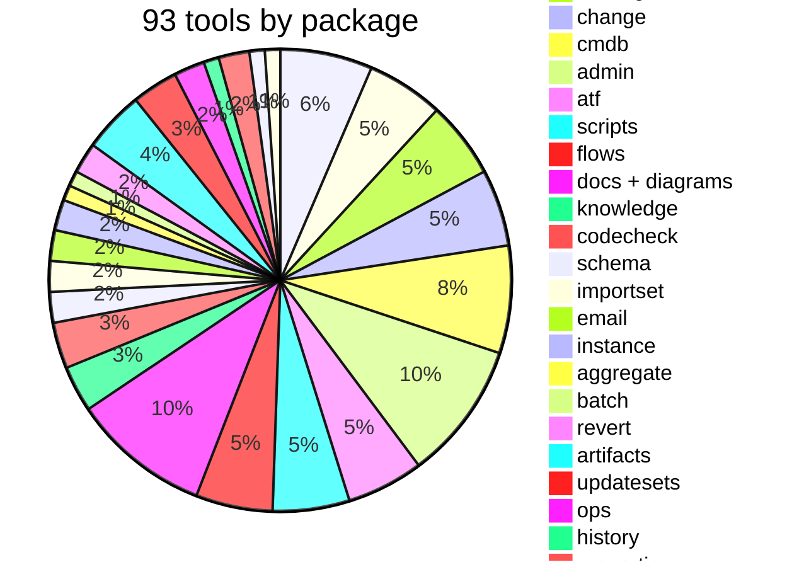
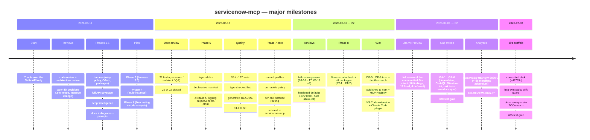

# servicenow-mcp — Product State

Date: 2026-07-06 · clean build · clean ESLint (type-checked + layer boundaries) · **406/406 tests** (coverage 95.41% lines / 84.94% branches / 98.58% functions) · CI: Node 20/22/24 + macOS matrix (lint + format also on Windows), coverage (lines 94 / branches 82 / functions 97) + prod-audit gates, CodeQL SAST + weekly dependabot · git history one-commit-per-task.
**Phase 6 is complete** (the optional X-8 HTTP transport shipped in v2.0 as DF-6): layered core/api/mcp/tools directories, a declarative tool manifest (a package is a plug-in), elicitation, MCP logging, outputSchema, the email package. **Phase 7 (multi-instance) is complete** (MI-1…MI-8: profiles, per-profile policy, per-call routing, snapshot, comparison, per-profile resources). **Phase 8 (flow testing + code checking) is complete** (FT-1…FT-7: the `flows`, `codecheck` and `atf` packages — deterministic table-event tracing, Flow Designer reading + run history, a local lint rule set + code-health report, ATF runs via the CI/CD API). **Phase 9 / v2.0 is complete** (DF-0…DF-6 trust + depth + reach; v2.0.0 published 2026-06-22 — npm `servicenow-mcp-ai` now at 2.0.1, MCP Registry, Claude Code plugin, VS Code extension 2.0.1). A **Jira Cloud client scaffold** (`src/core/jira/`, `src/api/jira/` — no tools yet) was reviewed 2026-07-01, committed **dark** on 2026-07-03 (`ad2799c`, with an http-twin parity drift guard) and awaits the ARCH-14 go/no-go decision (see [BUSINESS-REVIEW-2026-07.md](BUSINESS-REVIEW-2026-07.md) §5 and §8).
**2026-09 note:** the code state is unchanged since 2026-07-06. On 2026-09-02 the gate was **red** — `npm audit --omit=dev --audit-level=high` (the last step of `npm run check`) exited 1 on two HIGH transitive advisories via `@modelcontextprotocol/sdk@1.29.0`; a five-lens deep review ([DEEP-REVIEW-2026-09.md](DEEP-REVIEW-2026-09.md)) and the proposed v3.0 plan ([ROADMAP-V3.md](ROADMAP-V3.md)) were written that day. On 2026-09-03 item **H-1** landed locally (SDK `^1.30.0`, zod `^3.25.0`, lock-only audit fix) and the gate is **green** again (406/406, audit 0). On 2026-09-09 **H-2** followed (`servicenow_set_credentials` refuses an instance change without `user` + `password` in the same call — `CREDENTIALS_INCOMPLETE` — and its confirmation fails closed unless `SN_ALLOW_UNCONFIRMED_CREDENTIAL_CHANGE=1`; 414/414), then **E-9** on 2026-09-10 (crash handlers log one structured line and exit 1, `dispose()` resets the singletons on signals / HTTP session close, LRU schema cache `SN_SCHEMA_CACHE_MAX`; 431/431) and **H-10** on 2026-09-23 (one `getDispatcher` for proxy / TLS without a client cert, identifying `User-Agent`, `SN_DEADLINE_MS`, bounded per-host queue → `BUSY`, `UPSTREAM_HTML` shaping, OAuth through the shared client, host:port / IPv6 policy, opt-in breaker; 481/481, coverage 96.04 / 86.44 / 98.44) , **S-1** the same day (`servicenow_trace_table_event` / `servicenow_generate_table_flow` include inherited and global business rules in `order`, flow triggers / workflows / notifications filtered by the traced operation, `getTableChain` cached; 486/486, coverage 96.13 / 86.48 / 98.47) and **H-9** (CI + version hygiene: SHA-pinned actions, `permissions: contents: read`, concurrency / timeouts / actionlint, `pack:check` tarball guard with `!build/**/jira/**`, `sync-version` + `npm version` hook + `test/version-sync.test.js`, checksummed `mcp-publisher` 1.8.1, `.env*` ignore rules, Prettier idempotency; 494/494, coverage 96.01 / 86.56 / 98.49), then **H-8** (a 2xx HTML page — hibernating PDI, login / SSO — fails with `INSTANCE_HTML_RESPONSE`, `fetchAll` reads past ACL-shortened pages under a scan budget and reports `truncatedReason` / `filtered`, `display_value=all` pairs are redacted and rendered, attachment edges pinned, plugin inactive vs missing on a namespace 404, drift / where-used results carry `caveats`; 519/519, coverage 96.15 / 87.06 / 98.52, `pack:check` 78 files / 456.2 KB, audit 0) — the 2.1.0 hardening batch is complete; nothing is committed. A post-3.0 SDK parity epic (P-1…P-29, owner gates O-5…O-9) is planned in [SDK-PARITY.md](SDK-PARITY.md). On 2026-09-09 a second-pass gap analysis ([GAP-ANALYSIS-2026-09.md](GAP-ANALYSIS-2026-09.md) — nine narrower lenses, 67 findings, 9 high, six corrections to the first review) extended the tracker with **H-10, H-11, S-13, M-9, D-9, E-9** and the breaking entries B11–B13; every finding carries a design, acceptance criteria and tests so it can be implemented directly. On 2026-09-23 a third, focused pass on instance documentation ([INSTANCE-DOCS-ANALYSIS-2026-09.md](INSTANCE-DOCS-ANALYSIS-2026-09.md) — 17 findings `ID-01`…`ID-17`: the docs store, the Mermaid generators, the `document_table` prompt, the missing table / app / instance documents) added **S-14, S-15, S-16** and refined nine definitions of done; S-14 (docs store v2 + generator depth) joins the must-have cut. On 2026-09-25 a second instance-documentation pass ([INSTANCE-DOCS-ANALYSIS-2026-09-25.md](INSTANCE-DOCS-ANALYSIS-2026-09-25.md) — the dispositions of `ID-01`…`ID-17` after batch 6, plus `ID-18`…`ID-29`) refined S-15 (registry-driven `document_app` over P-5's `listArtifacts`, the `security` kind from S-3's `securityScan()`, named E-7 collectors), S-16, M-4, M-8, S-7, E-6 and E-7; docs only.
Related documents: [ARCHITECTURE.md](ARCHITECTURE.md) (how it is built), [DONE.md](DONE.md) (everything completed), [ROADMAP.md](ROADMAP.md) (forward plan), [IMPLEMENTATION-PLAN.md](IMPLEMENTATION-PLAN.md) (detailed specs), [WORKLOG.md](../WORKLOG.md) (chronology), [CHANGELOG.md](../CHANGELOG.md).

## 1. TL;DR — what works today

A full ServiceNow MCP server: **93 tools in 26 packages**, 7 MCP resources (package-gated), 5 prompts. Covers all core ServiceNow REST APIs (Table, Aggregate, Attachment, Import Set, Batch, CMDB/IRE) and the plugin APIs (Catalog, Change, Knowledge, Email) with capability detection. **v2.0 — trust + depth + reach:** plan-and-apply write safety (`SN_WRITE_MODE`, default plan) plus a local audit journal across all 13 write tools; a capability preflight (`check_capabilities` + degrade); an ACL security scan folded into `code_health`; a where-used / impact graph; client-side field redaction (PII); a token-guarded Streamable HTTP transport (`SN_TRANSPORT=http`); CSV export; and a `drift` CI gate. Reads and analyses the instance's script automation (business rules, script includes, client scripts…), traces what a table operation would run, lints scripts against a local rule set and runs ATF tests via the CI/CD API, generates Mermaid diagrams and maintains a local Markdown self-documentation store. Two-axis policy model (tables + packages), named connection profiles with per-call routing, **every ServiceNow auth method** (Basic, OAuth 2.1 Authorization Code + PKCE, client_credentials, refresh_token, JWT bearer, API key, bearer token, mutual TLS), retry/backoff, SSRF guard, structured errors.

## 2. ServiceNow API surface coverage

| ServiceNow API                      | Status | How                                                                                                                                       |
| ----------------------------------- | :----: | ----------------------------------------------------------------------------------------------------------------------------------------- |
| Table API (CRUD + queries)          |   ✅   | `table` package; fetchAll pagination, X-Total-Count, display values                                                                       |
| Aggregate / Stats                   |   ✅   | `servicenow_aggregate`: count/avg/min/max/sum + group_by/having                                                                           |
| Attachment                          |   ✅   | list/meta/download/upload/delete; base64, size guard before download                                                                      |
| Import Set                          |   ✅   | staging insert + transform outcome                                                                                                        |
| Batch (`/api/now/v1/batch`)         |   ✅   | several REST calls in one request; policy per sub-request                                                                                 |
| CMDB Instance / Meta / IRE          |   ✅   | class-aware CRUD through Identification & Reconciliation                                                                                  |
| Service Catalog (`sn_sc`)           |   ✅   | browsing + variables + **order now**; plugin-aware                                                                                        |
| Change Management (`sn_chg_rest`)   |   ✅   | typed create (normal/standard/emergency), conflicts, update                                                                               |
| Knowledge (`sn_km_api`)             |   ✅   | relevance search, article, featured/most-viewed                                                                                           |
| Schema (`sys_db_object/dictionary`) |   ✅   | list/describe **with super_class inheritance chain**                                                                                      |
| Scripts (via the Table API)         |   ✅   | 9 artefact types: list/source/code search/`table_logic`                                                                                   |
| Diagrams / documentation            |   ✅   | Mermaid ER + table flow; local MD store + resources                                                                                       |
| Email API                           |   ✅   | `email` package: send (pluginCall + write policy) / get                                                                                   |
| Multi-instance work                 |   ✅   | profiles + per-profile policy + per-call routing (MI-1…MI-5); `snapshot_instance`, `compare_instances`, per-profile resources (MI-6…MI-8) |
| CI/CD + ATF                         |   ✅   | `atf` package: list/run tests + suites, poll results via the CI/CD API (FT-4; opt-in, non-default)                                        |
| Code Search (`sn_codesearch`)       |   ✅   | `search_code` uses it with `SN_CODESEARCH=true` (FT-7), LIKE fallback otherwise                                                           |
| Flow intelligence + code checking   |   ✅   | `flows` (trace/list/get/runs) + `codecheck` (lint + code-health) — Phase 8 FT-1/2/3/5/6                                                   |

## 3. How it is built (quality and infrastructure)

- **Language/runtime:** TypeScript strict + `noUncheckedIndexedAccess`, ESM, Node ≥ 20 (note: the default shell Node here is v12 — use nvm 22), MCP SDK 1.30 (floor `^1.30.0` since 2026-09-03).
- **Lint:** typescript-eslint type-checked + `no-floating-promises` + layer-boundary rules; Prettier (checked in CI).
- **Tests: 406 on 4 levels** (unit → api over mock fetch → in-memory MCP client → documentation guards, incl. property-based, perf and a manifest-integrity smoke that drives every tool), ~3.5 seconds, zero network. A contract snapshot protects the `core` tool list; sync tests protect the README tools table, the package description counts and the env reference (every `SN_*` var read in `src/` must appear in `README.md` **and** `.env.example` — `test/env-docs-sync.test.js`).
- **CI:** GitHub Actions (lint + format + build + test on Node 20/22/24 Linux + Node 22 macOS; lint + format also on the Windows leg; coverage gate `--lines 94 --branches 82 --functions 97`; prod-dependency audit; Node 12 launcher probe), plus CodeQL SAST and weekly dependabot (npm root + `extension/` + github-actions). Locally the same chain is one command: `npm run check`.
- **Documentation as code:** the README tools table is generated (`npm run docs:readme`); the env reference + `.env.example` are enforced by the sync test above; WORKLOG/DONE/TODO discipline after every task.

## 4. History — how we got here

The most important review fixes (full list in [DONE.md](DONE.md)): `describe_table` now sees inherited columns (critical for any extended table such as `incident`); batch can no longer bypass the table policy via stats/import/cmdb URLs; plugin APIs have a capability cache; credentials live in an atomic ConfigStore; a per-package policy axis covers the plugin APIs.

## 5. What is NOT done (roadmap)

Detailed specifications live in [IMPLEMENTATION-PLAN.md](IMPLEMENTATION-PLAN.md) — written as a handoff spec:

| Phase                                           | What                                                                                                                                                                                                                                                                                                                                                                                                                                                                                                                                                                                                                                                               | Effort                       | Key tasks                                                                                                                                                                                                  |
| ----------------------------------------------- | ------------------------------------------------------------------------------------------------------------------------------------------------------------------------------------------------------------------------------------------------------------------------------------------------------------------------------------------------------------------------------------------------------------------------------------------------------------------------------------------------------------------------------------------------------------------------------------------------------------------------------------------------------------------ | ---------------------------- | ---------------------------------------------------------------------------------------------------------------------------------------------------------------------------------------------------------- |
| ~~8 · Flow testing + code analysis~~            | **done (2026-06-19)** — `flows` + `codecheck` + `atf` packages (FT-1…FT-7)                                                                                                                                                                                                                                                                                                                                                                                                                                                                                                                                                                                         | —                            | shipped                                                                                                                                                                                                    |
| ~~9 · v2.0 differentiators~~                    | **done (2026-06-22)** — DF-0…DF-6 (see [ROADMAP-V2.md](ROADMAP-V2.md))                                                                                                                                                                                                                                                                                                                                                                                                                                                                                                                                                                                             | —                            | shipped as v2.0.0 / 2.0.1                                                                                                                                                                                  |
| 3.0 · correctness + governance + reach at scale | **proposed (2026-09-02; H-1 done 2026-09-03, H-2 done 2026-09-09, E-9 done 2026-09-10, H-10, S-1, H-8, H-9, H-5, H-6, E-3, S-2 and S-14 done 2026-09-23, M-3, S-3, S-8, P-1, S-4, S-13, D-2, P-3, P-4, M-8, S-9, E-5 and P-5 done 2026-09-24, M-4, S-7, S-5 and P-6 done 2026-09-25 — 870/870; second pass 2026-09-09, instance-docs passes 2026-09-23 and 2026-09-25)** — a 2.1.x hardening pack (audit gate, `set_credentials` guard, plan tokens, policy-axis gaps, HTTP client resilience, process lifecycle, inherited-BR trace) then the breaking 3.0.0 cluster (Node 22, renames, error contract, multi-session HTTP, fail-fast settings, protected tables) | ~12–15 weeks (must-have cut) | [ROADMAP-V3.md](ROADMAP-V3.md) H-1…H-11, M-1…M-9, S-1…S-13, D-1…D-9, E-1…E-9, O-1…O-4; evidence in [DEEP-REVIEW-2026-09.md](DEEP-REVIEW-2026-09.md) and [GAP-ANALYSIS-2026-09.md](GAP-ANALYSIS-2026-09.md) |
| Undecided                                       | the dark Jira Cloud surface (committed, no tools) — go/no-go, safety rails, packaging                                                                                                                                                                                                                                                                                                                                                                                                                                                                                                                                                                              | owner call                   | ARCH-14 in TODO.md; [BUSINESS-REVIEW-2026-07.md](BUSINESS-REVIEW-2026-07.md) §5 + §8.2                                                                                                                     |
| Owner actions                                   | GA-8 distribution execution, DX-3 demo GIF, GA-9 PDI e2e nightly                                                                                                                                                                                                                                                                                                                                                                                                                                                                                                                                                                                                   | owner call                   | TODO.md owner actions; [BUSINESS-REVIEW-2026-07.md](BUSINESS-REVIEW-2026-07.md) §8.4                                                                                                                       |
| Optional                                        | PDI e2e suite, XLSX export (needs a binary-writer dep), vitest migration                                                                                                                                                                                                                                                                                                                                                                                                                                                                                                                                                                                           | on request                   | the "Optional" section in the plan                                                                                                                                                                         |

## 6. Known limitations and deliberate decisions

- **Hardened defaults (2026-06-17):** `.env` is written owner-only (`0600`); a request host must be `*.service-now.com` unless `SN_ALLOWED_HOSTS` is set (the SSRF guard + X-2 elicitation still apply on top). These were the two former "won't-fix" single-user risks, flipped for the public release.
- **Table policy ≠ plugin policy:** denying a table does not stop the plugin APIs — that is what the package axis (`SN_PACKAGES_DENY`/`SN_PACKAGES_READONLY`) is for; documented in the README security section.
- **No code execution on the instance** (incl. background scripts) — ATF through the official CI/CD API is the shipped alternative (Phase 8, opt-in).
- **The whole test suite is mock-fetch** — nothing yet proves the server against a live instance; the PDI e2e nightly is tracked as GA-9 (owner, needs a PDI + credentials).
- **The Jira Cloud client scaffold is committed but dark** (`ad2799c`, 2026-07-03) — `src/core/jira/` + `src/api/jira/shared.ts` are reviewed, tested and drift-guarded (`test/http-twin-parity.test.js`), but expose no tools and no registry entry until the ARCH-14 decision (safety rails: package axis, plan/apply, journal, redaction).

## 7. Document compass

| File                                                                         | Contents                                                                                                                                                                                                                                                                                                                                                                          |
| ---------------------------------------------------------------------------- | --------------------------------------------------------------------------------------------------------------------------------------------------------------------------------------------------------------------------------------------------------------------------------------------------------------------------------------------------------------------------------- |
| [README.md](../README.md)                                                    | setup, env reference, generated tools table, examples, security                                                                                                                                                                                                                                                                                                                   |
| [ARCHITECTURE.md](ARCHITECTURE.md)                                           | layers, diagrams, policy/auth/config models, ADR decisions                                                                                                                                                                                                                                                                                                                        |
| [PRODUCT-STATE.md](PRODUCT-STATE.md)                                         | this file — what/how far/how                                                                                                                                                                                                                                                                                                                                                      |
| [ROADMAP.md](ROADMAP.md)                                                     | forward plan: what shipped (Phases 1–9, v2.0), the proposed 3.0, on-request items, tech-debt                                                                                                                                                                                                                                                                                      |
| [ROADMAP-V3.md](ROADMAP-V3.md)                                               | the proposed v3.0 execution tracker (2026-09-02): pillars H/M/S/D/E/O, sequencing, definition of done, breaking-change register, exit criteria                                                                                                                                                                                                                                    |
| [DEEP-REVIEW-2026-09.md](DEEP-REVIEW-2026-09.md)                             | the five-lens deep review behind v3.0: MCP protocol, ServiceNow coverage, security, DX/distribution, engineering — every finding with evidence, severity and its roadmap item                                                                                                                                                                                                     |
| [GAP-ANALYSIS-2026-09.md](GAP-ANALYSIS-2026-09.md)                           | the 2026-09-09 second pass over the v3.0 plan: nine narrower lenses (network client, data/write path, policy, operator/model UX, MCP surface, runtime, observability, auth, tests/CI/packaging), 67 findings each with gap, evidence, design, acceptance and tests, corrections to the first review, finding → item index                                                         |
| [INSTANCE-DOCS-ANALYSIS-2026-09.md](INSTANCE-DOCS-ANALYSIS-2026-09.md)       | the 2026-09-23 instance-documentation pass: the docs store, the Mermaid generators, the `document_table` prompt and the missing document kinds — 17 findings each with gap, evidence, design, acceptance and tests, target store layout v2, finding → item index (S-14 … S-16)                                                                                                    |
| [INSTANCE-DOCS-ANALYSIS-2026-09-25.md](INSTANCE-DOCS-ANALYSIS-2026-09-25.md) | the 2026-09-25 second instance-documentation pass against the batch-6 tree: dispositions of ID-01 … ID-17, 12 new findings ID-18 … ID-29 (per-writer versions, manifest runs, JSON companions, registry-driven `document_app`, the `security` kind, named E-7 collectors, prompt gating, writer goldens, the registry catalog in discovery), finding → item index, deltas applied |
| [COMPETITIVE-ANALYSIS.md](COMPETITIVE-ANALYSIS.md)                           | positioning vs the official MCP Server Console; Phase 9 boost plan; risks                                                                                                                                                                                                                                                                                                         |
| [BUSINESS-ANALYSIS-V2.md](BUSINESS-ANALYSIS-V2.md)                           | market, business model, monetization; what "v2.0" means as a milestone                                                                                                                                                                                                                                                                                                            |
| [ROADMAP-V2.md](ROADMAP-V2.md)                                               | the v2.0 execution tracker (DF-0…DF-6, DX-1/DX-3) with definition of done                                                                                                                                                                                                                                                                                                         |
| [BUSINESS-REVIEW-2026-07.md](BUSINESS-REVIEW-2026-07.md)                     | post-2.0 business review: delivery scorecard, adoption reality, the Jira decision, 30-day plan                                                                                                                                                                                                                                                                                    |
| [UX-REVIEW-2026-07.md](UX-REVIEW-2026-07.md)                                 | post-2.0 UX/DX review: onboarding funnel, tool surface, errors, docs site, prioritized backlog                                                                                                                                                                                                                                                                                    |
| [IMPLEMENTATION-PLAN.md](IMPLEMENTATION-PLAN.md)                             | Phase 6–8 specifications + optional items                                                                                                                                                                                                                                                                                                                                         |
| [DONE.md](DONE.md)                                                           | everything completed, with commit references                                                                                                                                                                                                                                                                                                                                      |
| [TODO.md](TODO.md)                                                           | backlog (triple analysis S2/A2/Q2), release checklist R-1…R-9, won't-fix                                                                                                                                                                                                                                                                                                          |
| [WORKLOG.md](../WORKLOG.md)                                                  | detailed chronology: problem/solution/alternatives/verification                                                                                                                                                                                                                                                                                                                   |
| [CHANGELOG.md](../CHANGELOG.md)                                              | user-facing change overview (Keep a Changelog)                                                                                                                                                                                                                                                                                                                                    |
