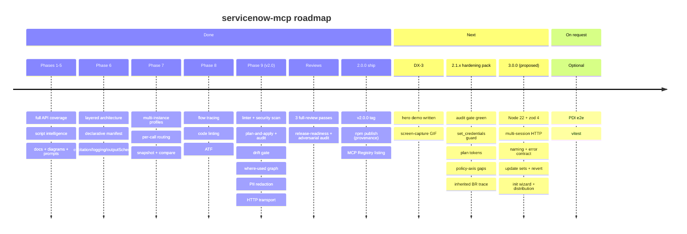

# servicenow-mcp — Roadmap

Date: 2026-09-02 · Status: **v2.0 — trust + depth + reach** shipped (406/406 tests, coverage 95.41/84.94/98.58, full REST coverage, every auth method, Phases 1–9 + DX; see [ROADMAP-V2.md](archive/ROADMAP-V2.md)) · **Next: v3.0 proposed** — execution tracker in [ROADMAP-V3.md](ROADMAP-V3.md), findings in [DEEP-REVIEW-2026-09.md](archive/DEEP-REVIEW-2026-09.md) and the 2026-09-09 second pass [GAP-ANALYSIS-2026-09.md](archive/GAP-ANALYSIS-2026-09.md); the 2026-09-23 instance-documentation pass [INSTANCE-DOCS-ANALYSIS-2026-09.md](archive/INSTANCE-DOCS-ANALYSIS-2026-09.md) added S-14 … S-16; its 2026-09-25 second pass [INSTANCE-DOCS-ANALYSIS-2026-09-25.md](archive/INSTANCE-DOCS-ANALYSIS-2026-09-25.md) reassessed ID-01 … ID-17 and added ID-18 … ID-29 (`document_table` / `document_app` unblocked on 2.x).
This is the forward-looking view. Full task specifications live in
[IMPLEMENTATION-PLAN.md](archive/IMPLEMENTATION-PLAN.md); completed work with commit refs is in
[DONE.md](DONE.md); the current state is in [PRODUCT-STATE.md](archive/PRODUCT-STATE.md).

## Where we are

- **Shipped (Phases 1–9 + v2.0):** 67 tools in 18 packages over the full ServiceNow REST surface
  (Table, Aggregate, Attachment, Import Set, Batch, CMDB/IRE, Catalog, Change, Knowledge, Email),
  script intelligence, Mermaid generators, a local self-documentation store, a two-axis policy
  model, named multi-instance profiles with per-call routing, OAuth/Basic, retry/backoff, an SSRF
  guard, and a single enforced quality gate (`npm run check`).
- **Hardened (2026-06-17 review):** `fetchAll` truncation is visible to snapshot/compare; the
  `result`-envelope unwrap is uniform; the Batch API obeys the package axis and rejects
  path-traversal bypasses; `.env` is written `0600`; a host must be `*.service-now.com` unless
  `SN_ALLOWED_HOSTS` is set.
- **Gate status:** on 2026-09-02 `npm run check` was **red** on its last step (two HIGH transitive
  advisories through `@modelcontextprotocol/sdk@1.29.0`). **Fixed 2026-09-03 as H-1** of
  [ROADMAP-V3.md](ROADMAP-V3.md): SDK floor `^1.30.0`, zod `^3.25.0`, lock-only audit fix — the
  gate is green again locally (406/406, audit 0), uncommitted.

## Shipped — 2.0.0 (R-2 complete, 2026-06-22)

v2.0 is **tagged and published**: npm `servicenow-mcp-ai@2.0.0` (the `latest` tag, built with
`--provenance --access public` from CI, never a laptop) and the **MCP Registry** lists
`io.github.IvanBBaev/servicenow-mcp-ai → 2.0.0`.

- [x] Tagged **`v2.0.0`** on the release HEAD; the `CHANGELOG [Unreleased]` entries were folded
      under the dated `[2.0.0]` heading.
- [x] The GitHub repo is **public** and the **`NPM_TOKEN`** secret is bound.
- [x] `git push origin main` with the CI matrix green (ubuntu 20/22/24, macOS, Windows), then the
      tag fired `publish.yml` (which re-ran the gate before publishing).
- [x] Listed on the **MCP Registry** (`publish-mcp.yml` via `server.json`) — the discovery half
      of DX-1.

## Done — Phase 8 · Logical flow testing + code checking (2026-06-19)

> _"Run logical tests on different flows and check the code."_ **Shipped:** the `flows` package
> (`trace_table_event`, `list_flows`/`get_flow`, `get_flow_runs`), the `codecheck` package
> (`lint_script`/`lint_table` over a local rule set, `code_health`), the `atf` package
> (`list`/`run`/`get` via the CI/CD API — opt-in, non-default; the run tools execute on the
> instance), and FT-7 (`search_code` uses `sn_codesearch` when `SN_CODESEARCH=true`, LIKE fallback).
> 12 new tools (65 total, 18 packages), 22 new tests (219 total), gate green. New packages are
> **not** in the default `core` profile — enable with `SN_TOOL_PACKAGES`. Full specs:
> [IMPLEMENTATION-PLAN.md](archive/IMPLEMENTATION-PLAN.md) §8.

Recommended order (highest value first):

| #   | Task                                                    | Package     | Notes                                                          |
| --- | ------------------------------------------------------- | ----------- | -------------------------------------------------------------- |
| 1   | **FT-2** · `trace_table_event` — deterministic flow sim | `flows`     | Highest value, zero new APIs; builds on `tableLogic` + Mermaid |
| 2   | **FT-1** · `list_flows` / `get_flow` (Flow Designer)    | `flows`     | Structured view of `sys_hub_flow` (+ legacy workflows)         |
| 2   | **FT-3** · `get_flow_runs` — execution evidence         | `flows`     | `sys_flow_context`/`sys_flow_log`; closes the FT-2 loop        |
| 3   | **FT-5** · `lint_script` / `lint_table` — local rules   | `codecheck` | Deterministic regex rules in pure TS, no new dependency        |
| 3   | **FT-6** · `code_health(scope?)` — aggregate report     | `codecheck` | Writes `docs/instance/<profile>/code-health.md`                |
| 4   | **FT-4** · ATF runs via the CI/CD API                   | `atf`       | Executes on the instance; needs a PDI with the plugin + roles  |
| 5   | **FT-7** · Code Search upgrade (`sn_codesearch`)        | `scripts`   | Optional; LIKE fallback stays                                  |

- [x] **FT-2** — ordered execution chain (display → before BRs → engines → after → async + flows +
      notifications/events) with conditions and an optional Mermaid flowchart.
- [x] **FT-1** — `list_flows` (metadata) + `get_flow` (parsed trigger/steps/subflows); legacy
      `wf_workflow`/`wf_activity` via `kind: "workflow"`.
- [x] **FT-3** — flow run history by flow or by record; BR errors via a `syslog` prompt hint.
- [x] **FT-5** — rule set: `hardcoded-sys-id`, `gr-unbounded-query`, `query-in-loop`,
      `current-update-in-br`, `set-workflow-false`, `eval-usage`, `gs-sleep`, `gs-log-deprecated`,
      `hardcoded-instance-url`, client `gr-on-client` / `sync-get-reference`; optional `new Function`
      syntax check.
- [x] **FT-6** — counts by type, active/inactive, last touched, findings by severity, top offenders.
- [x] **FT-4** — `list_atf_tests`/`_suites`, `run_atf_test`/`_suite` (POST `/api/sn_cicd/...`),
      `get_atf_result`; run tools are `readOnlyHint: false`.
- [x] **FT-7** — use `sn_codesearch` when present (probe via `pluginCall`); keep the LIKE fallback.

## Done — Phase 9 (v2.0) · Competitive differentiators (the lane the official MCP Server abandons)

> Positioning: the official **ServiceNow MCP Server Console** owns governed,
> production enterprise actions (paid Now Assist SKU, metered, on-instance). It
> structurally does **not** serve developers and consultants who need to
> _understand and safely change_ an instance — any instance, including a free
> PDI, with the model and client of their choice. Phase 9 widens exactly that
> lane: the "win where they can't follow" set.

| Key      | Item                                                    | Status / builds on                                   |
| -------- | ------------------------------------------------------- | ---------------------------------------------------- |
| **DF-0** | Capability preflight + recommended read-role profile    | ✅ shipped — precondition for DF-1/DF-4 (see R1/R2)  |
| **DF-1** | Instance linter + security scan                         | ✅ shipped — ACL scan folded into `code_health`      |
| **DF-2** | Plan-and-apply: dry-run write preview + local audit log | ✅ shipped — all 13 instance-mutating write tools    |
| **DF-3** | Cross-instance drift gate (CI report, deployment risk)  | ✅ shipped — `servicenow-mcp-ai drift <a> <b>` CLI   |
| **DF-4** | Where-used: reference & impact graph                    | ✅ shipped — `servicenow_where_used` + Mermaid graph |
| **DF-5** | Field-level redaction before results reach the model    | ✅ shipped — `SN_REDACT_FIELDS` / `SN_REDACT_PII`    |
| **DF-6** | HTTP transport (= **X-8**, promoted)                    | ✅ shipped — `SN_TRANSPORT=http` (loopback + token)  |

- [x] **DF-0** — capability preflight (an admin tool + a `servicenow://capabilities`
      resource): on connect, probe which `sys_*` artefact tables the connected user
      can actually read and return an "achievable capabilities" map, so the script
      intelligence / linting tools never promise reads the user cannot make. The
      moat (DF-1/DF-4) depends on reading admin-restricted `sys_script*` /
      `sys_security_acl` rows that a least-privilege user often cannot; ship a
      documented **recommended read-role profile** (the minimal roles for script
      intelligence) and have DF-1/DF-4 degrade gracefully — "N artefacts unreadable
      (needs role X)" — rather than returning a silently empty report. Closes the
      permission paradox in [COMPETITIVE-ANALYSIS.md](COMPETITIVE-ANALYSIS.md) R1/R2.
- [x] **DF-1** — fold a security dimension into `code_health`: shipped for
      `eval`/side-effects/`gs.getUser()` in ACL evaluation scripts and roles-only
      ACLs (no condition + no script), gated behind DF-0. Ships in the `codecheck`
      package next to the FT-5 code-quality rules; one aggregated `code-health.md`
      covers both. _2.1:_ extend to tables with no ACL, public Scripted REST/pages
      and admin-overlap roles.
- [x] **DF-2** — a "plan" mode for every write tool: resolve the target and
      return a structured before/after diff **without** mutating, gated by
      `apply: true` (default via `SN_WRITE_MODE=plan|apply`). Every executed
      mutation is appended to a local, append-only journal
      (`docs/instance/<profile>/write-journal.{md,jsonl}`) — a client-side audit
      trail where there is no AICT. Pairs with the existing X-2 elicitation.
- [x] **DF-3** — promote `compare_instances` to a release artifact: one drift
      report (tables/columns/scripts by SHA-256/plugins) with a non-zero exit
      signal for CI, plus an update-set / deployment-risk preview ("what this set
      changes in the target") and an instance-vs-its-own-past diff from snapshot
      history.
- [x] **DF-4** — `where_used(table|field|script)`: a cross-artefact reference
      graph (business rules → tables/fields, script-include call graph, fields
      referenced in rules/UI policies) rendered as JSON + an optional Mermaid
      graph. Read-only; reuses the script-intelligence readers.
- [x] **DF-5** — a redaction policy (`SN_REDACT_FIELDS` + built-in PII detectors:
      email, phone, national IDs) applied in `mcp/result.ts` **before** records
      are serialised for the model, so sensitive values never leave the process.
      Reported as "n fields redacted".
- [x] **DF-6** — see **X-8** below; promoted from optional because it turns the
      server from a local-only tool into something the ServiceNow MCP **Client**
      app and remote clients can consume — competitor becomes supplier.

## Adoption — developer experience & discovery (highest leverage for uptake)

> The competitive analysis ([COMPETITIVE-ANALYSIS.md](COMPETITIVE-ANALYSIS.md) §8)
> found that uptake among programmers is capped less by features than by
> discovery, real-instance permissions and a sharp first demo. These four levers
> move that needle; **DF-0** (the permission preflight) is the fourth and lives in
> Phase 9.

- [x] **DX-1 · Publish & be discoverable** _(shipped)_ — the **Claude Code plugin / skills bundle**
      (`.claude-plugin/`) and a **VS Code extension** (`extension/`), plus the **npm publish**
      (`servicenow-mcp-ai@2.0.0`, provenance) and the **MCP Registry** listing
      (`io.github.IvanBBaev/servicenow-mcp-ai`). Discovery and one-command install are the single
      biggest adoption lever.
- [x] **DX-2 · Safe by default** — the out-of-the-box posture is now safe: **DF-2 makes
      writes plan-by-default** (`SN_WRITE_MODE=plan`), so an LLM cannot delete/mutate on
      any table without an explicit `apply: true`. A fully read-only `core`
      (`SN_READONLY=true`) profile would be the remaining, narrower step.
- [~] **DX-3 · One sharp dev demo** — the README/site hero **scenario is shipped**: a
  "Quick demo" section in both [README.md](../README.md#quick-demo) and the docs site
  (`#quick-demo`) for the 10-second hook — "find every usage of this field"
  (`where_used`), "what runs when I save this record" (`trace_table_event` / flow
  trace) and "diff dev vs prod" (`drift`). **Remaining:** the screen-capture GIF (a
  manual recording) to drop into the hero.
- [x] **DX-4 = DF-0** — capability preflight + recommended read-role profile, so the
      demo that dazzles on a PDI still delivers on a governed instance (Phase 9).

## Next — 3.0 · correctness + governance + reach at scale (proposed 2026-09-02)

> **v1.x = breadth, v2.0 = trust + depth + reach, v3.0 = correctness + governance + reach at
> scale.** Derived from five read-only audits (MCP protocol, ServiceNow coverage, security,
> DX/distribution, engineering) documented in [DEEP-REVIEW-2026-09.md](archive/DEEP-REVIEW-2026-09.md);
> the sequenced tracker with a definition of done per item is [ROADMAP-V3.md](ROADMAP-V3.md).
> **H-1** landed 2026-09-03 (green gate) and **H-2** (credential host binding: `CREDENTIALS_INCOMPLETE`,
> fail-closed confirmation, `SN_ALLOW_UNCONFIRMED_CREDENTIAL_CHANGE`) on 2026-09-09, **E-9** (crash handlers, `dispose()`, LRU schema cache `SN_SCHEMA_CACHE_MAX`) on
> 2026-09-10 and **H-10** (HTTP client resilience + identity: proxy / TLS without a client cert, `User-Agent`, `SN_DEADLINE_MS`, bounded queue, error codes) , **S-1** (inherited + global business rules in the trace and the table-flow diagram) and **H-9** (CI + version hygiene: SHA-pinned actions, least-privilege workflow permissions, tarball guard, one-version sync) on 2026-09-23 — all uncommitted; next H-8; everything else is 🔴. A second, narrower pass
> on 2026-09-09 ([GAP-ANALYSIS-2026-09.md](archive/GAP-ANALYSIS-2026-09.md) — nine lenses, 67 findings, 9 high) added
> **H-10, H-11, S-13, M-9, D-9, E-9**, the breaking entries B11–B13 and extended 27 definitions of done. A third,
> focused pass on 2026-09-23 ([INSTANCE-DOCS-ANALYSIS-2026-09.md](archive/INSTANCE-DOCS-ANALYSIS-2026-09.md) — instance documentation: the docs store,
> the Mermaid generators, the `document_table` prompt, the missing table / app / instance documents; 17 findings) added
> **S-14, S-15, S-16** (docs store v2 + generator depth, document generators, native discovery) and refined nine
> definitions of done; S-14 joins the must-have cut. A fourth pass on 2026-09-25
> ([INSTANCE-DOCS-ANALYSIS-2026-09-25.md](archive/INSTANCE-DOCS-ANALYSIS-2026-09-25.md) — the second on instance documentation, against
> the batch-6 tree) closed seven of the 17 findings, added **ID-18 … ID-29** and refined S-15 (registry-driven `document_app` over
> P-5's `listArtifacts`, the `security` kind from S-3, named E-7 collectors), S-16, M-4, M-8, S-7, E-6 and E-7.

| Pillar                    | What it fixes                                                                                                                                                                                                                                                                                                                                                                                                                                        | Items      |
| ------------------------- | ---------------------------------------------------------------------------------------------------------------------------------------------------------------------------------------------------------------------------------------------------------------------------------------------------------------------------------------------------------------------------------------------------------------------------------------------------- | ---------- |
| **H · Hardening**         | red audit gate; `set_credentials` host redirect; unconfirmed `apply:true`; policy-axis bypasses (batch / import set / attachments / plugin APIs); journal before-state + redaction everywhere; network edges (proxy/TLS/deadline/queue → H-10); multi-session HTTP; supply-chain pins; policy patterns + protected tables + write caps (H-11)                                                                                                        | H-1 … H-11 |
| **M · MCP conformance**   | `instructions`; error contract with a stable `code` (resources throw `McpError`); cancellation/progress; completions + reference resources; dynamic packages + `listChanged`; `tools/list` budget; naming pass                                                                                                                                                                                                                                       | M-1 … M-9  |
| **S · ServiceNow depth**  | inherited + global business rules in the trace; revert from the journal; ACL scan completeness; artefact breadth (widgets, UI pages, mail scripts…); flow depth; update-set awareness; richer schema/diff; keyset paging; structural where-used; docs store v2 (provenance, manifest, profile-scoped docs) + generator depth (ER options, trace-fed table flow, shared Mermaid module); table / app / instance document generators; native discovery | S-1 … S-16 |
| **D · DX & distribution** | `init` wizard + `--help/--version`; API-key/OAuth-aware "configured"; one generated env/manifest surface; client matrix; Docker + Smithery; version sync + pinned extension; extension UX; plugin skills                                                                                                                                                                                                                                             | D-1 … D-9  |
| **E · Engineering**       | Node ≥ 22.12 + c8 12; SDK/zod 4/TS/ESLint majors; runtime container instead of singletons; validated fail-fast settings; per-tool telemetry; test gaps; code-health; ARCH-10/14 closure                                                                                                                                                                                                                                                              | E-1 … E-9  |
| **O · Owner gates**       | ARCH-14 go/no-go; PDI credentials for the live smoke; distribution + KPI checkpoint; approval of the breaking-change register                                                                                                                                                                                                                                                                                                                        | O-1 … O-4  |

- **Release train:** everything non-breaking ships on **2.x** first (2.1.0 from the current
  `[Unreleased]` block + the hardening pack); the breaking cluster (Node 22 floor, tool renames,
  `snDetail` → `detail` + `code`, plan tokens for destructive apply, fail-fast settings,
  per-session HTTP profile, pinned extension, protected tables write-denied by default) ships as **3.0.0**, previewed as `3.0.0-beta.n` on the
  npm `next` tag. The register is in ROADMAP-V3 §"Breaking-change register".
- **Recommended cut:** the hardening pack (H-1 … H-9, plus H-10 and E-9 from the 2026-09-09 gap
  pass), the MCP items with S-13 before M-5, the five S must-haves (inherited-BR trace, revert, ACL
  completeness, artefact breadth, docs store v2 — S-14 from the 2026-09-23 instance-docs pass), the D onboarding/distribution set (D-9 with O-1) and the E
  platform bumps — roughly 13–16 weeks; H-11 rides the breaking cluster; the rest of S (including the
  table / app / instance document generators S-15 and native discovery S-16) and E is 3.x.
- **Deferred tech-debt now scheduled:** A2-2 → E-4, A2-3 → E-3, A2-5 → M-2; ARCH-10 / ARCH-14 → E-8
  and O-1; GA-8 / DX-3 → O-3; GA-9 → E-6 + O-2.

## On request — Optional (no phase)

- [ ] **Integration suite against a live PDI** — e2e behind an env gate (`SN_E2E=1` + real
      credentials), run manually/nightly, not in CI by default.
- [x] **Export API (CSV)** — `servicenow_query_table` `format: "csv"` (RFC-4180, reuses
      DF-5 redaction). XLSX not pursued.
- [x] **X-8 · HTTP transport** — shipped as **DF-6**: `SN_TRANSPORT=stdio|http` in
      `index.ts` (`StreamableHTTPServerTransport`, `SN_PORT`), loopback bind + optional
      `SN_HTTP_TOKEN`. Triggered the `mcp/transport.ts` extraction (A2-4).
- [ ] **vitest migration** — only if the `node:test` suite outgrows the runner.

## Deferred tech-debt (trigger-gated — not scheduled work)

These activate only when their trigger fires; doing them earlier is premature (see [TODO.md](TODO.md)). **2026-09-02:** the 3.0 analysis fired the triggers — A2-2, A2-3 and A2-5 are scheduled as E-4, E-3 and M-2 in [ROADMAP-V3.md](ROADMAP-V3.md):

- **A2-2** · unify settings into the profile ConfigStore — _trigger: a Phase 7 MI-1 follow-up._
- **A2-3** · replace global singletons (token/schema/plugin caches, telemetry) with a bootstrap
  container — _trigger: when multiple servers must share one process._
- **A2-4** · extract transport selection into `mcp/transport.ts` — **done** (the DF-6 HTTP
  request triggered it; `src/mcp/transport.ts`).
- **A2-5** · MCP resource errors are JSON content (no `isError` for resources) — _trigger: MCP
  protocol evolution._

## Guardrails (every phase)

Always-green gates, one commit per task, README/env docs kept in sync, and new tools added **only**
through the declarative manifest. Every behavioural change ships with a test in the same commit.
