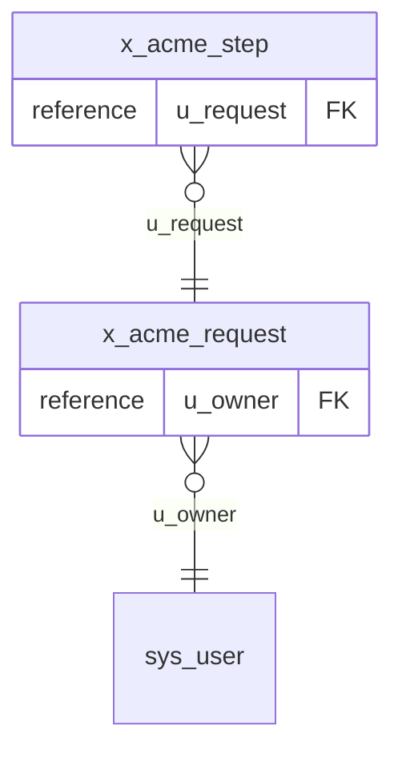

# Application `x_acme`

Generated by servicenow_document_app from the instance metadata of profile `default` (the timestamp is in the frontmatter). Text inside the manual block survives re-runs.

| Field | Value |
| --- | --- |
| Name | Acme Requests |
| Scope | `x_acme` |
| Version | 1.2.0 |
| Vendor | Acme |
| Record | sys_app `aaaaaaaaaaaaaaaaaaaaaaaaaaaaaaaa` |
| Description | Request intake |

- **Tables:** 2
- **Artefacts:** 4 in 4 type(s)

## Purpose

<!-- sn:manual:start purpose -->
<!-- sn:manual:end -->

## Tables

| Table | Label | Extends |
| --- | --- | --- |
| `x_acme_request` | Request | `task` |
| `x_acme_step` | Step |  |

### Entity relationships

## Roles

| name | sdkManaged | elevated_privilege | assignable_by | description |
| --- | --- | --- | --- | --- |
| x_acme.admin | unknown | false |  | Administers requests |

## Cross-scope privileges

_None._

## Artefacts

### Group `core`

#### `property` (`sys_properties`, 1)

| name | sdkManaged | type | is_private | read_roles | write_roles |
| --- | --- | --- | --- | --- | --- |
| x_acme.api_token | unknown | password2 |  |  |  |

### Group `server`

#### `business_rule` (`sys_script`, 1)

| name | active | sdkManaged | collection | global | when | order | condition |
| --- | --- | --- | --- | --- | --- | --- | --- |
| Default step order | true | unknown | x_acme_step |  | before | 100 |  |

#### `script_include` (`sys_script_include`, 1)

| name | key | active | sdkManaged | api_name | client_callable | access |
| --- | --- | --- | --- | --- | --- | --- |
| AcmeUtils | x_acme.AcmeUtils | true | unknown | x_acme.AcmeUtils | false | package_private |

## Not confirmed on this instance

These artefact types are not confirmed on a live instance (gate O-5): their table could not be read here, so they are left out rather than reported empty.

- `ui_page` (`sys_ui_page`)

## Caveats

- Unreadable: `client_script` (`sys_script_client`) could not be read by this user; its artefacts are missing here.
- Visibility: every read runs as this profile's user. On a domain-separated instance only the records of the user's domain (and its visible parents) are seen, and ACLs can hide definitions, so an absent entry is not proof that none exists.
- Metadata only: built from dictionary, automation and access-control definitions; no business records were read.
