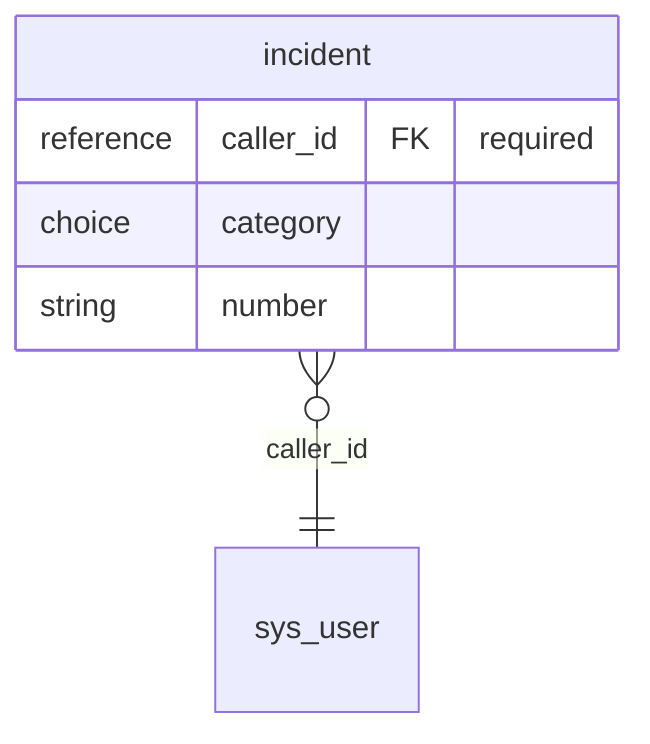
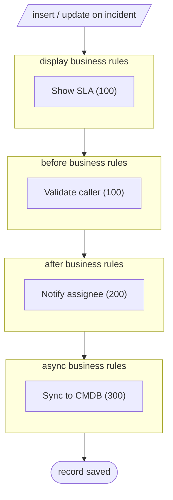

# Table `incident`

Generated by servicenow_document_table from the instance metadata of profile `default` (the timestamp is in the frontmatter). Text inside the manual block survives re-runs.

- **Inheritance:** `incident` → `task`
- **Columns:** 6 (3 own, 3 inherited)
- **Referenced by:** 2 column(s) on 2 table(s)

## Purpose

<!-- sn:manual:start purpose -->
<!-- sn:manual:end -->

## Columns

### Own columns (`incident`)

| Column | Label | Type | Reference | Mandatory | Default | Flags |
| --- | --- | --- | --- | --- | --- | --- |
| `caller_id` | Caller | reference | `sys_user` | yes |  |  |
| `category` | Category | choice |  |  | inquiry |  |
| `number` | Number | string |  |  |  |  |

### Inherited from `task`

| Column | Label | Type | Reference | Mandatory | Default | Flags |
| --- | --- | --- | --- | --- | --- | --- |
| `assigned_to` | Assigned to | reference | `sys_user` |  |  |  |
| `short_description` | Short description | string |  | yes |  |  |
| `sys_id` |  | GUID |  | yes |  |  |

## Referenced by

| Table | Column | Label |
| --- | --- | --- |
| `incident_task` | `incident` | Incident |
| `problem` | `u_incident` | Incident |

## Diagrams

### Entity relationships

### Record lifecycle

## Logic

### Business rules

| Name | When | Order | Active | Condition |
| --- | --- | --- | --- | --- |
| Validate caller | before | 100 | true |  |
| Notify assignee | after | 200 | true |  |
| Sync to CMDB | async | 300 | true |  |
| Show SLA | display | 100 | true |  |

### Client scripts

| Name | Type | Field | UI type | Active |
| --- | --- | --- | --- | --- |
| Category onChange | onChange | category | 0 | true |

### UI policies

| Name | Active | Run scripts |
| --- | --- | --- |
| Caller mandatory on new | true |  |

### UI actions

_Not readable for this user — see Caveats._

### ACLs

| Name | Operation | Roles | Active |
| --- | --- | --- | --- |
| `incident` | read | itil, sn_incident_read | true |
| `incident.caller_id` | write | itil | true |

## Caveats

- Unreadable: ui_action definitions could not be read by this user (the table needs a read role); that list is empty here. Run servicenow_check_capabilities.
- Visibility: every read runs as this profile's user. On a domain-separated instance only the records of the user's domain (and its visible parents) are seen, and ACLs can hide definitions, so an absent entry is not proof that none exists.
- Metadata only: built from dictionary, automation and access-control definitions; no business records were read.
